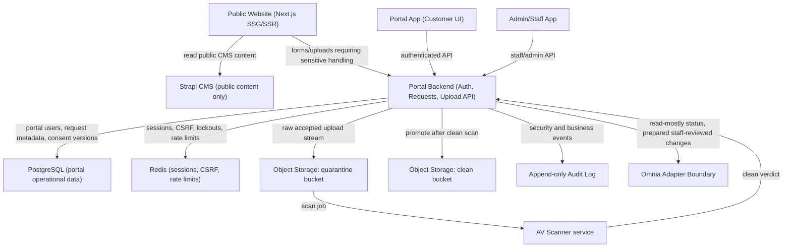

# Portal/Auth/Uploads: Backend Runtime und Deployment-Konzept

Dieses Dokument definiert die produktionsnahe Zielarchitektur fuer Portal-Auth, Portal-Requests und Uploads.
Es ersetzt keine finalen Rechtstexte und baut keine echte Omnia-Anbindung. Strapi bleibt ausschliesslich CMS fuer oeffentliche Inhalte.

## Architekturentscheidung

**Entscheidung: separates Backend fuer Portal/Auth/Uploads.**

Next.js API Routes oder Server Actions sollen fuer sensible Portal-, Auth- und Upload-Daten nicht die fuehrende Runtime sein.
Die Public Website bleibt Next.js mit SSG/SSR fuer SEO und Content. Portal, Admin und Upload-Flows sprechen ueber HTTPS mit einem getrennten Backend-Service.

Begruendung:

- Gesundheitsdaten und Rezeptdateien brauchen eine klar isolierte Sicherheitsgrenze.
- Upload-Streaming, Quarantaene, AV-Scan und Storage-Lifecycle passen besser zu einem dedizierten Backend als zu Public-Web-Routen.
- Rollenpruefung, Audit-Log, Rate-Limits, Sessions und Lockouts muessen zentral und framework-unabhaengig durchgesetzt werden.
- Strapi darf nicht zur Patientendatenablage werden und bleibt vom Portal-Datenpfad getrennt.
- Omnia bleibt fuehrendes System; das Backend erzeugt nur pruefbare Requests und vorbereitete Aenderungen.

Erlaubter Hybrid-Anteil:

- Next.js Public Website rendert SEO-/CMS-Seiten und sendet sensible Formular-/Upload-Aktionen nur an das Backend.
- Portal und Admin duerfen clientlastig bleiben, muessen aber alle geschuetzten Daten vom Backend beziehen.
- Next.js darf keine Rezeptdateien, Gesundheitsdaten, Portal-Sessions oder Staff-Aktionen persistieren.

Nicht empfohlen:

- Sensitive Uploads in Next.js Server Actions.
- Portal-Sessions ausschliesslich in JWTs ohne serverseitige Widerrufbarkeit.
- Rezeptdateien oder Gesundheitsdaten in Strapi.
- Direkte Omnia-Writes aus Kundenaktionen.

## Zielarchitektur

## Runtime-Komponenten

### Public Website

- Next.js App Router mit SSG/SSR fuer oeffentliche Seiten.
- Liest Strapi nur fuer redaktionelle Inhalte.
- Keine Portal-Cookies, keine Upload-Dateien, keine Gesundheitsdaten in Next.js-Persistenz.
- Oeffentliche Formulare mit Gesundheitsbezug senden an das Portal Backend.

### Portal App

- Kundenoberflaeche fuer Status, Uploads und Requests.
- Keine sensiblen Daten dauerhaft im Browser speichern.
- Keine lokalen Mockdaten im Produktionsbuild.
- Alle Mutationen laufen als Request-based Actions gegen das Backend.

### Admin/Staff App

- Interne Oberflaeche fuer Review, Freigaben und Request-Bearbeitung.
- Zugriff nur mit staff/admin Rolle.
- Keine direkte Omnia-Finalisierung ohne explizite Mitarbeiteraktion und Audit.
- Optional zusaetzlich per VPN, IP-Allowlist oder Identity-Aware Proxy absichern.

### Portal Backend

Empfohlen als separater TypeScript-Service, z.B. Fastify oder NestJS in einem Container.
Das bestehende Grundgeruest unter `apps/shared/backend` liefert die fachlichen Interfaces und Policies.

Aufgaben:

- Auth Runtime und Rollenpruefung.
- Session- und CSRF-Verwaltung.
- Upload-Annahme, Validierung, Quarantaene und AV-Orchestrierung.
- Portal-Request-Erzeugung.
- Staff-Review-APIs.
- Audit-Log.
- Omnia-Adapter-Grenze.

Der Service sollte in einer EU-Region laufen und nur ueber TLS erreichbar sein.
Interne Verbindungen zu PostgreSQL, Redis, Storage, AV und Omnia muessen privat oder strikt allowlisted sein.

## Infrastruktur

### PostgreSQL

Speichert operative Portal-Daten, nicht Strapi-Content:

- Portal-Kundenreferenzen und Omnia-Referenz-IDs.
- Credential-Metadaten und Passwort-Hashes.
- OTP-Hashes, Ablauf, Verbrauchsstatus und Versuchscounter.
- Request-Envelopes, Status und Review-Metadaten.
- Upload-Metadaten, Hashes, Scanstatus und Storage-Keys.
- Consent-Versionen und Audit-Referenzen.

Produktionsanforderungen:

- Verschluesselung at rest.
- TLS fuer Datenbankverbindungen.
- Keine Klartext-Passwoerter oder OTPs.
- Feldverschluesselung fuer besonders sensible optionale Request-Payloads.
- Migrationspflicht und Restore-Tests vor Go-live.

### Object Storage

Zwei strikt getrennte Buckets:

- `quarantine`: Uploads nach Annahme, vor AV-Freigabe.
- `clean`: nur nach erfolgreichem Scan und Freigabe durch Backend.

Anforderungen:

- Keine Public Buckets.
- KMS-Verschluesselung.
- Unguessable Objekt-Keys mit sicherer Upload-ID.
- Kein Originaldateiname als Storage-Key.
- Signed URLs nur kurzlebig und nur vom Backend erzeugt.
- Lifecycle-Regeln fuer Quarantaene, Clean-Daten und fehlgeschlagene Scans.
- Versionierung oder Object Lock fuer relevante Audit-/Beweisphasen pruefen.

### Redis oder vergleichbarer Session Store

Verwendung:

- Serverseitige Sessions.
- CSRF-Token oder Nonce-State.
- Rate-Limit-Counter.
- OTP/Login/Reset-Versuchscounter.
- Account-Lockout-Zustand.
- Kurze idempotency keys fuer Request-Erzeugung.

Anforderungen:

- TLS.
- Authentifizierung.
- Kein dauerhaftes Speichern sensibler Payloads.
- Definierte TTLs pro Key-Familie.

### AV-Scanner

MVP-nahe Optionen:

- ClamAV als interner Service.
- Managed Malware-Scanning fuer Object Storage.
- Externer Scan-Anbieter mit AV-Vertrag und EU-Datenverarbeitung.

Runtime-Regeln:

- Staff darf Dateien erst nach `clean` Verdict sehen.
- `infected`, `suspicious`, `timeout` und `scanner-error` blockieren Freigabe.
- Scan-Ergebnis, Signaturversion und Zeitstempel werden auditierbar gespeichert.
- Scanner-Ausfall fuehrt zu Warteschlange oder Ablehnung, nicht zu automatischer Freigabe.

### Audit-Log

Audit-Events muessen append-only und manipulationsarm sein.

Zu protokollieren:

- Login, Logout, fehlgeschlagene Logins und Lockouts.
- OTP-Ausgabe, Aktivierung, Ablauf und Verbrauch.
- Passwort-Reset-Anforderung und Abschluss.
- Upload-Annahme, Ablehnung, Scanstatus, Freigabe und Loeschung.
- Request-Erzeugung, Review, Ablehnung, Vorbereitung fuer Omnia.
- Rollen- und Staff-Aktionen.

Nicht protokollieren:

- Diagnosen.
- Freitexte mit Gesundheitsdaten.
- Dateiinhalte.
- Originaldateinamen, wenn sie sensible Hinweise enthalten koennen.

Technisch:

- Separate Audit-Tabelle oder eigener Audit-Store.
- Hash-Kette oder signierte Event-Batches fuer Manipulationserkennung.
- Strikte Retention und Export fuer Datenschutz-/Compliance-Prozesse.

### Backup und Restore

PostgreSQL:

- Point-in-time recovery.
- Taegliche Backups und Restore-Probe vor Go-live.
- Verschluesselte Backups.
- Retention nach Datenschutz- und Betriebsanforderung.

Object Storage:

- Lifecycle-Regeln pro Bucket.
- Optional Versioning fuer Clean-Bucket.
- Quarantaene-Objekte mit kurzer Retention fuer abgebrochene oder abgelehnte Scans.
- Loeschjobs muessen Audit-Events erzeugen.

Redis:

- Kein System of Record.
- Wiederherstellung darf Sessions und Rate-Limit-Zustand verlieren, aber keine Requests.

Audit:

- Separates Backup oder WORM-faehige Ablage pruefen.
- Restore-Prozess muss Audit-Integritaet erhalten.

## Auth Runtime

### Sessions und Cookies

- Serverseitige Session-IDs, gespeichert in Redis/PostgreSQL.
- Cookie: `HttpOnly`, `Secure`, `SameSite=Lax` oder fuer Admin `Strict`, host-only.
- Kurze idle TTL, absolute TTL und Rotation nach Login/Rollenwechsel.
- Session-Widerruf bei Passwortwechsel, Lockout oder Staff-Deaktivierung.
- Keine Rollen oder Gesundheitsdaten im Browser-Storage.

### CSRF-Schutz

- Fuer alle zustandsveraendernden Endpunkte verpflichtend.
- Synchronizer Token oder signiertes Double-Submit-Cookie.
- Zusaetzlich `Origin`/`Referer`-Pruefung.
- Token-Rotation nach Login und sensiblen Aktionen.

### Rate Limits

Mindestens:

- Login pro IP, Account und IP+Account-Kombination.
- OTP-Aktivierung pro Account und Code.
- Passwort-Reset pro Account und IP.
- Upload-Session-Erzeugung pro Account und IP.
- Public Kontakt-/Termin-/Upload-Formulare pro IP und Fingerprint-nahen, datensparsamen Signalen.

Limits muessen serverseitig in Redis oder aehnlich gespeichert werden.
Fehlermeldungen duerfen keine Account-Existenz verraten.

### Account Lockout

- Progressive Sperre nach fehlgeschlagenen Versuchen.
- Separate Zaehler fuer Login, OTP und Reset.
- Staff/Admin-Entsperrung mit Audit.
- Keine permanente automatische Sperre ohne Supportpfad.
- Benachrichtigung oder Hinweis nur datensparsam und ohne sensitive Details.

### Passwort-Reset

MVP:

- Reset ueber Mitarbeiterprozess oder neuen Brief-/Handout-Code.
- Reset-Token nur gehasht speichern.
- Kurze Gueltigkeit und Einmalverwendung.

Spaeter optional:

- Magic Link per E-Mail.
- Nur mit Rate-Limits, kurzer TTL, Anti-Enumeration und Session-Rotation.

### Einmalpasswort

- Ausgabe nur durch staff/admin fuer bestehende Kundenreferenz.
- Transport per Brief oder persoenlichem Handout.
- Speicherung nur als Hash plus Salt/Secret.
- Gueltigkeit z.B. 14 Tage, konfigurierbar.
- Einmalverwendung.
- Maximalversuche und Lockout.
- Audit fuer Ausgabe, Verbrauch, Ablauf und Sperre.

### Rollenpruefung

Rollen:

- `customer`: eigene Requests, Uploads und sichere Statusdaten.
- `staff`: Request-Review und Omnia-Vorbereitung.
- `admin`: Konfiguration, Rollenverwaltung, technische Betriebsaktionen.

Jede API prueft serverseitig:

- authentifizierte Session.
- Rolle.
- Objektzuordnung, z.B. customer darf nur eigene Requests sehen.
- Request-Status und erlaubte Transition.
- Audit-Pflicht fuer sensible Aktionen.

## Upload Runtime

### Upload-Ablauf

1. Client fordert eine Upload-Session beim Backend an.
2. Backend prueft Session oder Public-Upload-Kontext, Consent-Version und Rate-Limit.
3. Backend gibt Upload-ID und erlaubte Policy zurueck.
4. Datei wird an Backend oder direkt in Quarantaene mit streng begrenzter signed URL uebertragen.
5. Backend prueft Groesse und bricht bei Limitueberschreitung ab.
6. Backend sniffed MIME anhand Magic Bytes.
7. Backend akzeptiert nur Allowlist-Typen.
8. Backend schreibt Objekt in `quarantine`.
9. Backend startet AV-Scan.
10. Nur `clean` wird in `clean` promoted und fuer Staff-Review sichtbar.
11. Backend erzeugt oder aktualisiert den Portal-Request.
12. Jede Phase erzeugt ein Audit-Event.

### Upload-Policies

Startpolicy:

- Maximal 20 MB pro Datei.
- Allowlist: PDF, JPG, PNG, HEIC/HEIF.
- Keine ZIPs, Office-Dateien oder ausfuehrbaren Formate.
- Dateiendung nur als Zusatzsignal, nicht als Vertrauen.
- MIME-Sniffing verpflichtend.
- SHA-256 fuer Integritaet.

### Quarantaene und Clean Bucket

- Quarantaene-Dateien sind fuer Portal/Admin nicht direkt lesbar.
- Clean-Dateien sind nur ueber Backend-autorisierte, kurzlebige Zugriffe abrufbar.
- Infizierte oder nicht pruefbare Dateien bleiben gesperrt und werden nach Retention geloescht.
- Staff sieht zuerst Metadaten und Scanstatus, nicht ungepruefte Datei.

### Loesch- und Aufbewahrungskonzept

Vor Produktion fachlich zu bestaetigen:

- Abgebrochene Upload-Sessions: z.B. 24 Stunden.
- Abgelehnte/infizierte Dateien: kurze technische Retention fuer Incident-Pruefung, danach Loeschung.
- Clean-Rezeptdateien: nur so lange wie fuer Bearbeitung, Nachweis und gesetzliche Pflichten noetig.
- Audit-Events: laenger, aber ohne sensitive Inhalte.
- Kundenloeschung: Request, Upload-Metadaten, Dateien und Audit-Ausnahmen getrennt behandeln.

Loeschungen muessen idempotent sein und selbst Audit-Events erzeugen.

## Omnia-Grenze

- Omnia bleibt fuehrendes System.
- Backend liest Status read-mostly und zeigt nur sichere Portal-Snapshots.
- Kundenaktionen erzeugen Requests, keine finalen Omnia-Aenderungen.
- Staff prueft Requests und bereitet Aenderungen vor.
- Finale Aenderung erfolgt in Omnia oder ueber eine explizite Staff-Backend-Aktion mit Audit und Konfliktpruefung.
- Bei Omnia-Ausfall keine lokale Ersatzwahrheit erzeugen.

## Deployment-Modell

### Public Website

- Next.js Build/Hosting.
- Zugriff auf Strapi Public API oder serverseitige CMS-Fetches.
- Keine Secrets ausser CMS-Read-Konfiguration und nicht-sensitive Public Config.
- Security-Headers und Redirects auf Web-Ebene.

### Portal

- Separater Build oder separate App.
- Public erreichbar, aber Daten erst nach Backend-Auth.
- API-Origin fest auf Portal Backend.
- Keine Mock-Auth im Produktionsbuild.

### Admin

- Separater Build oder separate App.
- Zusaetzlich schuetzen: VPN, IP-Allowlist, Identity-Aware Proxy oder Zero-Trust Access.
- Staff/Admin-Rollen serverseitig im Backend erzwingen.

### Strapi

- Separater CMS-Service.
- Speichert nur redaktionelle Inhalte, Medien und Legal-Platzhalter.
- Keine Rezeptdateien, keine Gesundheitsdaten, keine Portal-Requests.
- Admin-Zugriff getrennt vom saniPEP-Portal-Admin.

### Backend

- Containerisierter Service in EU-Region.
- Private Netzwerkpfade zu DB, Redis, Storage, AV und optional Omnia.
- TLS an Edge/Load Balancer.
- Structured Logs ohne sensitive Payloads.
- Healthchecks fuer HTTP, DB, Redis, Storage und AV.
- Separate Staging- und Production-Umgebungen.

### Datenbank

- Managed PostgreSQL in EU-Region.
- Private Connectivity, TLS und Backups.
- Migrationen kontrolliert ueber CI/CD.
- Kein direkter Zugriff aus Public Website.

### Storage

- Object Storage in EU-Region.
- Getrennte Buckets fuer Quarantaene und Clean.
- KMS, Lifecycle, Block Public Access.
- Kein direkter Browserzugriff ohne kurzlebige, backend-autorisierte URL.

## ENV-Variablen

Keine produktiven Secrets committen. Werte muessen aus Secret Store, Hosting-ENV oder Vault kommen.

| Gruppe | Variable | Zweck |
| --- | --- | --- |
| Runtime | `PORTAL_BACKEND_BASE_URL` | Oeffentliche Backend-API-URL |
| Runtime | `NODE_ENV` | `development`, `staging`, `production` |
| Runtime | `TRUSTED_ORIGINS` | Erlaubte Public/Portal/Admin Origins |
| Runtime | `TRUSTED_PROXY_CIDRS` | Proxy-/Load-Balancer-Trust Boundary |
| Database | `PORTAL_DATABASE_URL` | PostgreSQL-Verbindung |
| Database | `PORTAL_DATABASE_SSL` | TLS-Erzwingung |
| Database | `FIELD_ENCRYPTION_KEY_ID` | Key-ID fuer Feldverschluesselung |
| Redis | `REDIS_URL` | Sessions, CSRF, Rate Limits |
| Redis | `REDIS_TLS` | TLS fuer Redis |
| Session | `PORTAL_SESSION_COOKIE_NAME` | Cookie-Name |
| Session | `PORTAL_SESSION_SECRET` | Signatur/Rotation, secret |
| Session | `PORTAL_SESSION_IDLE_TTL_MINUTES` | Idle TTL |
| Session | `PORTAL_SESSION_ABSOLUTE_TTL_HOURS` | Absolute TTL |
| CSRF | `CSRF_SECRET` | CSRF-Signatur, secret |
| Auth | `PORTAL_OTP_TTL_DAYS` | OTP-Ablauf |
| Auth | `PORTAL_OTP_MAX_ATTEMPTS` | OTP-Versuchslimit |
| Auth | `PORTAL_PASSWORD_PEPPER` | Passwort-Pepper, secret |
| Auth | `PASSWORD_RESET_TTL_MINUTES` | Reset-Token-Ablauf |
| Auth | `MAGIC_LINK_ENABLED` | Spaeterer optionaler Login-Kanal |
| Rate Limit | `RATE_LIMIT_LOGIN_WINDOW_SECONDS` | Login-Fenster |
| Rate Limit | `RATE_LIMIT_LOGIN_MAX_ATTEMPTS` | Login-Maximum |
| Rate Limit | `RATE_LIMIT_UPLOAD_MAX_PER_HOUR` | Upload-Limit |
| Upload | `UPLOAD_MAX_BYTES` | Serverseitiges Groessenlimit |
| Upload | `UPLOAD_ALLOWED_MIME_TYPES` | MIME-Allowlist |
| Upload | `UPLOAD_QUARANTINE_BUCKET` | Quarantaene-Bucket |
| Upload | `UPLOAD_CLEAN_BUCKET` | Clean-Bucket |
| Upload | `UPLOAD_KMS_KEY_ID` | Storage-Verschluesselung |
| Upload | `UPLOAD_SIGNED_URL_TTL_SECONDS` | Kurzlebige Upload-/Download-URLs |
| AV | `AV_SCANNER_MODE` | `clamav`, `managed`, `vendor`, `disabled-dev-only` |
| AV | `AV_SCANNER_ENDPOINT` | Interner Scanner-Endpunkt |
| AV | `AV_SCAN_TIMEOUT_SECONDS` | Scan-Timeout |
| Retention | `UPLOAD_ABORTED_RETENTION_HOURS` | Abgebrochene Uploads |
| Retention | `UPLOAD_REJECTED_RETENTION_DAYS` | Abgelehnte/infizierte Uploads |
| Retention | `UPLOAD_CLEAN_RETENTION_DAYS` | Clean-Retention bis finale Fachklaerung |
| Audit | `AUDIT_LOG_SINK` | DB, WORM, SIEM oder hybrid |
| Audit | `AUDIT_LOG_HASH_SECRET` | Hash-/Signatur-Secret |
| Audit | `AUDIT_LOG_RETENTION_DAYS` | Audit-Retention |
| Omnia | `OMNIA_API_BASE_URL` | Omnia-Adapter-Ziel |
| Omnia | `OMNIA_CLIENT_ID` | Omnia Client-ID |
| Omnia | `OMNIA_CLIENT_SECRET` | Omnia Secret |
| Omnia | `OMNIA_WRITE_MODE` | `read_only`, `prepared_only`, spaeter `staff_approved` |
| Observability | `LOG_LEVEL` | Logging-Level |
| Observability | `ERROR_TRACKING_DSN` | Error Tracking ohne sensitive Payloads |
| Observability | `OTEL_EXPORTER_OTLP_ENDPOINT` | Tracing/Monitoring |

## Sicherheitsgrenzen

- Browser ist nicht vertrauenswuerdig.
- Next.js Public Website ist nicht Portal-Backend.
- Strapi ist nicht System fuer Patientendaten.
- Redis ist nicht System of Record.
- Quarantaene ist nicht staff-lesbar.
- Clean-Bucket ist nicht public.
- Omnia ist fuehrend fuer finale Fach- und Kundendaten.
- Audit-Log enthaelt keine sensiblen Payloads.

## DSGVO- und Betriebsrisiken

P0/P1 vor Produktion:

- Rechtsgrundlagen, Einwilligungen, TOMs und AV-Vertraege muessen final geklaert werden.
- Gesundheitsdaten in Portal-Requests brauchen strikte Zweckbindung, Retention und Zugriffskontrolle.
- Backups enthalten potentiell sensible Daten und brauchen Loesch-/Restore-Konzept.
- AV-Scanner kann falsch-negative oder timeoutende Ergebnisse liefern.
- OTP per Brief/Handout braucht einen belastbaren Identitaets- und Supportprozess.
- Staff/Admin-Zugriffe brauchen Schulung, Rollenmodell, Audit und Entzugspfad.
- Omnia-API-Vertrag, Konfliktregeln und manuelle Freigabeprozesse sind noch offen.
- Incident Response fuer Datenpannen und Malware-Funde ist noch nicht definiert.

P2:

- Magic Link spaeter nur als optionaler Komfortkanal.
- WORM-Audit-Storage kann nach MVP ergaenzt werden, falls regulatorisch gefordert.
- Customer Self-Service fuer Datenexport/Loeschanfragen kann spaeter erweitert werden.

## Naechster Implementierungssprint

1. Backend-App anlegen, z.B. `apps/backend` als TypeScript Fastify/NestJS-Service.
2. PostgreSQL-Schema und Migrationen fuer Nutzer, Credentials, Sessions, Requests, Uploads und Audit erstellen.
3. Redis-basierte Sessions, CSRF und Rate-Limits implementieren.
4. OTP-Aktivierung und Passwort-Login produktionsnah an DB/Hasher anbinden.
5. Upload-Session-Endpunkte, serverseitige Validierung und Quarantaene-Storage anbinden.
6. AV-Scanner-Adapter mit `clean`, `infected`, `suspicious`, `timeout` und Retry-Status implementieren.
7. Staff-Review-Endpunkte mit Rollenpruefung und Audit implementieren.
8. Omnia-Adapter als `read_only`/`prepared_only` Stub mit Vertragstests vorbereiten.
9. Deployment-Staging mit PostgreSQL, Redis, Storage, AV und Backend-Healthchecks aufbauen.
10. Security-/Privacy-Abnahme: Threat Model, Datenschutzkonzept, Backup-Restore-Test und Incident Runbook.

## Explizit nicht enthalten

- Keine echte Omnia-Anbindung.
- Keine echten Patientendaten.
- Keine echte Rezeptspeicherung im Repo.
- Keine finalen Rechtstexte.
- Keine Produktions-Secrets.
